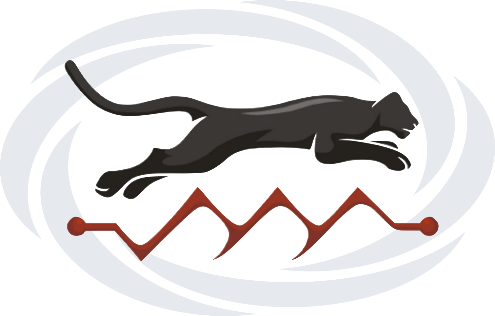

| **Documentation** | **Chat** | **Build Status**| **Changelog**|
|:-----------------------------------------------------:|:------------------------------------:|:-----------:|:-------:|
| [](https://docs.circuitscape.org/Omniscape.jl/stable) [](https://docs.circuitscape.org/Omniscape.jl/latest) | [](https://gitter.im/Circuitscape/Omniscape.jl) | [](https://travis-ci.com/Circuitscape/Omniscape.jl) [](https://ci.appveyor.com/project/vlandau/omniscape-jl) [](https://codecov.io/gh/Circuitscape/Omniscape.jl) | [](https://github.com/Circuitscape/Omniscape.jl/releases) |

Omniscape.jl is built on [Circuitscape.jl](https://github.com/Circuitscape/Circuitscape.jl) and implements the Omniscape connectivity modeling algorithm to map omni-directional habitat connectivity. The Omniscape algorithm was developed by [McRae and colleagues](https://www.researchgate.net/publication/304842896_Conserving_Nature's_Stage_Mapping_Omnidirectional_Connectivity_for_Resilient_Terrestrial_Landscapes_in_the_Pacific_Northwest) in 2016. **Check out [the docs](https://circuitscape.github.io/Omniscape.jl/stable) for additional information.**

## Installation

**The latest version of Omniscape.jl requires Julia version 1.5 or greater**. You can install Julia [here](https://julialang.org/downloads/). Once installation is complete, open a Julia terminal and run the following code to install Omniscape.jl.
```julia
using Pkg; Pkg.add("Omniscape")
```
If you want to install the latest (unreleased) development version of Omniscape, you can get it by running:
```julia
using Pkg; Pkg.add(PackageSpec(name = "Omniscape", rev = "main"))
```

## Citing Omniscape.jl

A formal paper detailing Omniscape.jl is currently [in pre-review](https://github.com/openjournals/joss-reviews/issues/2777). Until it is published, please use the following to cite Omniscape.jl if you use it in your work:
> Landau, V. A. 2020. Omniscape.jl: Software to compute omnidirectional landscape connectivity, vX.Y.Z, URL: https://github.com/Circuitscape/Omniscape.jl, DOI: 10.5281/zenodo.3955123.

Here's a bibtex entry:
```
@misc{landau2020omniscape,
    title = {{Omniscape.jl: An efficient and scalable implementation of the Omniscape algorithm in the Julia programming language}},
    author = {Vincent A. Landau},
    year = {2020},
    version = {v0.4.3},
    url = {https://github.com/Circuitscape/Omniscape.jl},
    doi = {10.5281/zenodo.3955123}
}
```

Please also cite the [original work](https://www.researchgate.net/publication/304842896_Conserving_Nature's_Stage_Mapping_Omnidirectional_Connectivity_for_Resilient_Terrestrial_Landscapes_in_the_Pacific_Northwest) where the Omniscape algorithm was first described:
> McRae, B. H., K. Popper, A. Jones, M. Schindel, S. Buttrick, K. R. Hall, R. S. Unnasch, and J. Platt. 2016. Conserving Nature’s Stage: Mapping Omnidirectional Connectivity for Resilient Terrestrial Landscapes in the Pacific Northwest. *The Nature Conservancy*, Portland, Oregon.

## Contributing
Contributions in the form of pull requests are always welcome and appreciated. To report a bug or make a feature request, please [file an issue](https://github.com/Circuitscape/Omniscape.jl/issues/new). For general discussions and questions about usage, start a conversation on [gitter](https://gitter.im/Circuitscape/Omniscape.jl).

## Acknowledgments
Development of this software package was made possible by funding from NASA's Ecological Forecasting program and the Wilburforce Foundation through a project led by Kim Hall at The Nature Conservancy. This software package would not have been possible without Brad McRae (1966-2017), the visionary behind Circuitscape, the Omniscape algorithm, and several other software tools for assessing connectivity. Omniscape.jl is built on [Circuitscape.jl](https://github.com/Circuitscape/Circuitscape.jl), which was authored by Ranjan Anantharaman and Viral Shah, both of whom have been incredibly helpful in steering and guiding the development of Omniscape.jl. Kim Hall, Aaron Jones, Carrie Schloss, Melissa Clark, Jim Platt, and early Omniscape.jl users helped steer software development by providing valuable feedback and insight.
