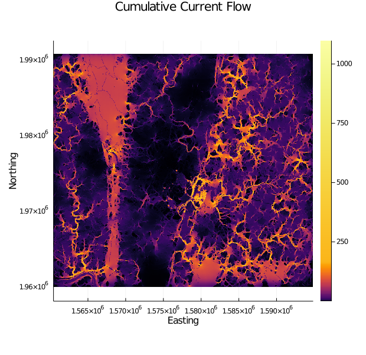

### Forest connectivity in central Maryland using

Land cover datasets are commonly used to parameterize resistance for connectivity modeling. This example uses the [National Land Cover Dataset](https://www.usgs.gov/centers/eros/science/national-land-cover-database) for the United States to model forest connectivity in central Maryland. Each value in the categorical land cover dataset is assigned a resistance score. We can have Omniscape.jl can assign these values internally by providing a reclassification table (see [Resistance Reclassification](@ref)).

First, install the necessary packages and import them:

```julia
using Pkg; Pkg.add(["Omniscape", "GeoData", "Plots"])
using Omniscape, GeoData, Plots
```

Next, download the inputs for this problems:

```julia
# Download example input data
url_base = "https://raw.githubusercontent.com/Circuitscape/datasets/main/"

# The NLCD tile used to create the resistance surface
download(string(url_base, "data/nlcd_2016_frederick_md.tif"),
         "nlcd_2016_frederick_md.tif")
# The reclass table used to conver land cover class into a resistance value
download(string(url_base, "omniscape/nlcd-md-example/nlcd_reclass_table.txt"),
         "nlcd_reclass_table.txt")
# The INI file the specifies run options
download(string(url_base, "omniscape/nlcd-md-example/nlcd_ex.ini"),
         "nlcd_ex.ini")
```

Finally, run Omniscape:

```julia
run_omniscape("nlcd_ex.ini")
```

You'll see that outputs are written to a new folder called "md_nlcd_omniscape_output". This is specified by the "project_name" value in the INI file downloaded above. The cumulative current map is called "cum_currmap.tif" and will be located in the output folder.

Now, load the current map back into Julia using [GeoData.jl](https://github.com/rafaqz/GeoData.jl) and plot it:

```julia
current = GDALarray("md_nlcd_omniscape_output")
plot(current,
     title = "Cumulative Current Flow", xlabel = "Easting", ylabel = "Northing",
     seriescolor = cgrad(:inferno, [0, 0.005, 0.03, 0.06, 0.1, 0.15]),
     size = (620, 600))
```

```@raw html
 <br><em><b>Figure 1</b>: Cumulative current flow output representing forest connectivity in central Maryland.</em><br><br>
```

