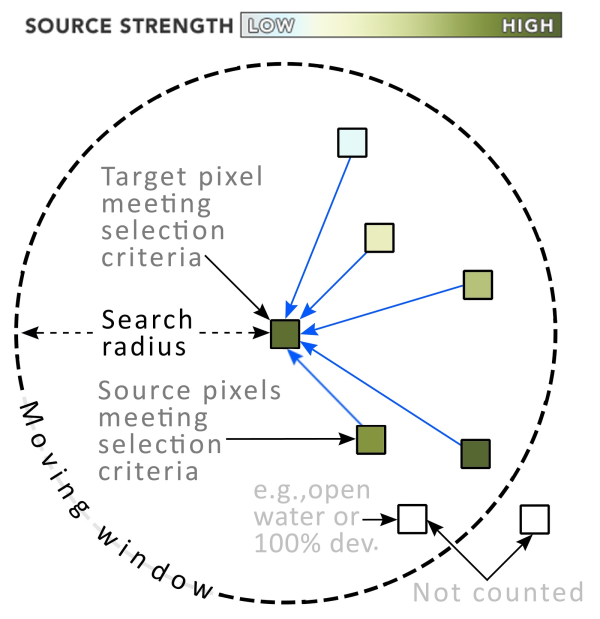

# Omniscape.jl

*Omniscape.jl implements the Omniscape connectivity algorithm developed by [McRae et al. (2016)](https://www.researchgate.net/publication/304842896_Conserving_Nature's_Stage_Mapping_Omnidirectional_Connectivity_for_Resilient_Terrestrial_Landscapes_in_the_Pacific_Northwest).*

Package repository: [https://github.com/Circuitscape/Omniscape.jl](https://github.com/Circuitscape/Omniscape.jl)

!!! note

    Before proceeding, it is strongly recommended that you familiarize yourself with the circuit theoretic approach to modeling landscape connectivity. See [McRae 2006](https://circuitscape.org/pubs/McRae_2006_IBR_Evolution.pdf) and [McRae et al. 2008](https://circuitscape.org/pubs/McRae_et_al_2008_Ecology.pdf) to learn more. See [Anantharaman et al. 2020](https://proceedings.juliacon.org/papers/10.21105/jcon.00058) for more on [Circuitscape.jl](https://github.com/Circuitscape/Omniscape.jl).

### Table of Contents

```@contents
Depth = 2
```

## The Omniscape Algorithm

Omniscape works by applying Circuitscape iteratively through the landscape in a moving window with a user-specified radius. Omniscape requires two basic inputs: a resistance raster, and a source strength raster. The resistance raster defines the traversal cost for every pixel in the landscape. The source strength raster defines for every pixel the relative amount of current to be injected into that pixel. A diagram of the moving window, adapted and borrowed from McRae et al. 2016, is shown in figure 1 below.

```@raw html
 <br><em><b>Figure 1</b>: An illustration of a moving window iteration in the Omniscape algorithm.</em><br><br>
```

The algorithm works as follows:
1. The window centers on a pixel in the source strength surface that has a source strength greater than 0 (or a user specified threshold). This is referred to as the target pixel.
2. The source strength and resistance rasters are clipped to the circular window.
3. Every source pixel within the search radius that also has a source strength greater than 0 is identified. These are referred to as the source pixels.
4. Circuitscape is run using the clipped resistance raster in “advanced” mode, where the target pixel is set to ground, and the source pixels are set as current sources. The total amount of current injected is equal to the source strength of the target pixel, and is divvied up among the source pixels in proportion to their source strengths.
5. Steps 1-4 are repeated for every potential target pixel. The resulting current maps are summed to get a map of cumulative current flow.

The Omniscape algorithm evaluates connectivity between every possible pair of pixels in the landscape that are a) valid sources (i.e. have a source strength greater than 0 or other user-specified threshold) and b) no further apart than the moving window radius.

### Outputs

Omniscape.jl provides three different outputs.
1. **Cumulative current flow**: the total current flowing through the landscape -- the result of the Omniscape algorithm described above.
2. **Flow potential** (optional): current flow under "null" resistance conditions. Flow potential demonstrates what movement/flow would look like when movement is unconstrained by resistance and barriers. Flow potential is calculated exactly as cumulative current flow is, but with resistance set to 1 for the entire landscape.
3. **Normalized current flow** (optional): calculated as cumulative current flow divided by flow potential. Normalized current helps identify areas where current is impeded or channelized (e.g. more or less current than expected under null resistance conditions). High values mean current flow is channelized, low values mean current is impeded.

### Climate Connectivity

Climate connectivity can be modeled using the conditional connectivity options in Omniscape. These options options allow the user to impose extra constraints on source and target identification and matching. For example the present day climate of the source pixels might be required to be similar to the projected future climate for the target pixel. Info on constraints is provided to Omniscape via raster layers. See the documentation on [Conditional Connectivity Options](@ref) for more info on how to implement this feature.


## Citing Omniscape.jl

A formal paper detailing Omniscape.jl is forthcoming, but until it is published, please use something like the following to cite Omniscape.jl if you use it in your work:
> Landau, VA 2020. Omniscape.jl: An efficient and scalable implementation of the Omniscape algorithm in the Julia programming language, vX.Y.Z, URL: https://github.com/Circuitscape/Omniscape.jl, DOI: 10.5281/zenodo.3955123.

Note that the DOI listed here is stale (docs are written prior to the new DOI being issued). You can go to https://zenodo.org/ and search for Omniscape to ensure you use the correct DOI.

Here's a bibtex entry:
```
@misc{landau2020omniscape,
    title = {{Omniscape.jl: An efficient and scalable implementation of the Omniscape algorithm in the Julia programming language}},
    author = {Vincent A. Landau},
    year = {2020},
    version = {v0.4.3},
    url = {https://github.com/Circuitscape/Omniscape.jl},
    doi = {10.5281/zenodo.3955123}
}
```
Please also cite the [original work](https://www.researchgate.net/publication/304842896_Conserving_Nature's_Stage_Mapping_Omnidirectional_Connectivity_for_Resilient_Terrestrial_Landscapes_in_the_Pacific_Northwest) outlining the Omniscape algorithm:
> McRae, B. H., K. Popper, A. Jones, M. Schindel, S. Buttrick, K. R. Hall, R. S. Unnasch, and J. Platt. 2016. Conserving Nature’s Stage: Mapping Omnidirectional Connectivity for Resilient Terrestrial Landscapes in the Pacific Northwest. *The Nature Conservancy*, Portland, Oregon.

## Acknowledgments
Development of this software package was made possible by funding from NASA's Ecological Forecasting program and the Wilburforce Foundation through a project led by Kim Hall at The Nature Conservancy. This software package would not have been possible without Brad McRae (1966-2017), the visionary behind Circuitscape, the Omniscape algorithm, and several other software tools for assessing connectivity. Omniscape.jl is built on [Circuitscape.jl](https://github.com/Circuitscape/Circuitscape.jl), which was authored by Ranjan Anantharaman and Viral Shah, both of whom have been incredibly helpful in steering and guiding the development of Omniscape.jl. Kim Hall, Aaron Jones, Carrie Schloss, Melissa Clark, Jim Platt, and early Omniscape.jl users helped steer software development by providing valuable feedback and insight.


## References

Anantharaman, R., Hall, K., Shah, V., & Edelman, A. (2020). Circuitscape in Julia: Circuitscape in Julia: High Performance Connectivity Modelling to Support Conservation Decisions. *Proceedings of the JuliaCon Conferences*. DOI: 10.21105/jcon.00058.

McRae, B. H. (2006). Isolation by resistance. *Evolution*, 60(8), 1551-1561.

McRae, B. H., Dickson, B. G., Keitt, T. H., & Shah, V. B. (2008). Using circuit theory to model connectivity in ecology, evolution, and conservation. *Ecology*, 89(10), 2712-2724.

McRae, B. H., Popper, K., Jones, A., Schindel, M., Buttrick, S., Hall, K., Unnasch, B. & Platt, J. (2016). Conserving nature’s stage: mapping omnidirectional connectivity for resilient terrestrial landscapes in the Pacific Northwest. *The Nature Conservancy*, Portland, Oregon.


