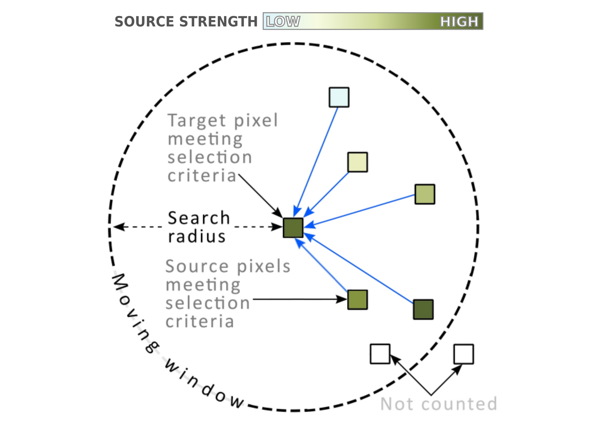

# Summary and Motivation

Modeling where and how ecological processes are connected in geographic space provides valuable information for widlife and landscape management. A common output from such efforts is a connectivity map, which provides a spatial representation of connectivity by showing likely paths of flow for ecological processes (e.g. wildlife movement or dispersal, gene flow, disease, or fire). Circuit theory offers a useful framework for modeling these processes [@mcrae2006; @mcrae2008; dickson2019]. In the circuit-theoretic approach, the landscape is abstracted as a network of current sources, grounds, and resistors. The resulting current flow through the network is then related to movement or flow intensity of the ecological process of interest. These models are implemented in the Circuitscape software [@shah2008; @anantharaman2020]. Circuitscape is most often run in "pairwise" mode, where current flow is calculated between pairs user-defined "cores" (usually habitat patches or their centroids). Results from this method can be highly sensitive to the location of cores, which can be problematic in cases where core location is arbitrary, or when there is uncertainty about where cores should be placed. The Omniscpe algorithm [@mcrae2016] offers an alternative, coreless approach to pairwise Circuitscape and computes so-called omni-directional landscape connectivity by implementing Circuitscape iteratively in a moving window. Code for Python was developed to implement the Omniscape algorithm in @mcrae2016, but a robust, user-friendly software package was not available. To fill this need, we developed Omniscape.jl, an easy-to-use software package written in the Julia programming langauge. We chose Julia over Python because of its superior speed, use of multiple dispatch, and so that it would interface well with the latest version of Circuitscape, which is also implemented in Julia.

# The Omniscape Algorithm

Omniscape works by applying Circuitscape iteratively through the landscape in a moving window with a user-specified radius. Omniscape requires two basic spatial data inputs: a resistance raster, and a source strength raster. The resistance raster defines the traversal cost for every pixel in the landscape. The source strength raster defines for every pixel the relative amount of current to be injected into that pixel. A diagram of the moving window, adapted and borrowed from @mcrae2006, is shown in \autoref{fig:window}.

The algorithm works as follows:

1 .The window centers on a pixel in the source strength surface that has a source strength greater than 0 (or a user specified threshold). This is referred to as the target pixel.
2. The source strength and resistance rasters are clipped to the circular window.
3. Every source pixel within the search radius that also has a source strength greater than 0 is identified. These are referred to as the source pixels.
4. Circuitscape is run using the clipped resistance raster in “all-to-one” mode, where the target pixel is set to ground, and the source pixels are set as current sources. The total amount of current injected is equal to the source strength of the target pixel, and is divvied up among the source pixels in proportion to their source strengths.

Steps 1-4 are repeated for every potential target pixel. The resulting current maps from each moving window iteration are summed to get a final map of cumulative current flow.

# Acknowledments

# References
